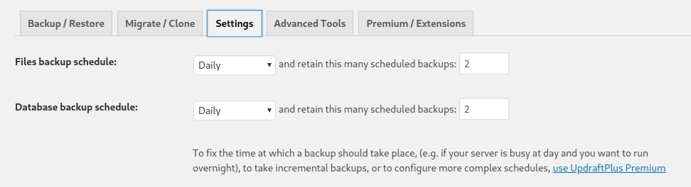
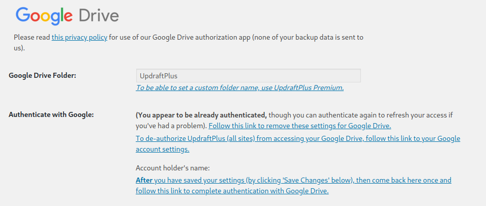

# ansible-automation

This repository contains the [Ansible](https://docs.ansible.com/projects/ansible/latest/getting_started/introduction.html) playbook and roles of the [Épicerie Le Détour](https://epicerieledetour.org/). It configures the different servers (VPS or self-hosted) and services (custom software, backup setups or third-party open source softwares) needed for the épicerie's mission, for example:
- multi store borg backups
- Google Drive proxies so the drives can be backuped on our systems
- Wordpress, Grafana and Mattermost instances
- Custom applications to [check members status](https://github.com/epicerieledetour/ledetour-membres) or to [scan the food vouchers](https://github.com/epicerieledetour/ledetour-vouchers) of the [Nourrir la Pointe](https://www.nourrirlapointe.ca/bons-solidaires) program.

A [Vagrant](https://developer.hashicorp.com/vagrant) setup allows development, experimentation, tests and staging deployment on safe, local virtual machines. Actual server deployment and upgrades are only ran when they are deemed to work well locally on a virtual network.

This Ansible and Vagrant setups are currently in a bad state and cannot be fully ran as-is: this problem is currently being worked on as part of the [Ansible setup upgrade project](https://github.com/orgs/epicerieledetour/projects/2/views/2).


## Core values

### Code is the documentation

In a context where IT management is both mission critical for the organization but managed by volunteers with limited available time, Ansible allows to represent the desired state of the system by a single source of truth: the playbook. Manually configureing servers and services then documentating said configuration will without doubt lead to a desynchronisation between the real state of the systems and its documented state. With an [infrastructure-as-code](https://en.wikipedia.org/wiki/Infrastructure_as_code) system, the expected final state of the system is expressed as code, and the code acts as the documentation.


### Self-hosted Open Source Software

The Épicerie le Détour is a self-managed organization. It strives on do-it-yourself and continuous, community based improvements of culture and processes. These core values strongly matches those of OSS. From a technical point of view, Open Source allows to experiment, deploy and maintain a frictionless service stack without spending volunteer time in negociation and procurement with third-party commercial entities.

To further minimize dependencies, reduce friction and centralize configuration, third-party SaaS are kept to a minimum, [Slack](https://epicerieledetour.slack.com) and Google Drives being the current exceptions. Al other services are self-hosted and self-maintained.


### Centralized authentication

As we already use Google Apps for emails, calendars and shared drive, we use Google authentification services as much as possible. For exemple, Grafana or Wordpress accounts are accessed through the Google authentification services.


### Server and data security

Network security and absolute resistance to cracking is way beyond the reach of a volunteer-based grocery store. There is no expectation on the ability of the organization to defend itself against a targetted attack like a [DDoS](https://en.wikipedia.org/wiki/Denial-of-service_attack).

However, the Épicerie Le Détour tries to stick to common sense good practices.

- **Backup and redundancy**: all important data and document are automatically backuped on a regular basis and stored to several different physical locations. Google Drives are also regularly cloned and backuped in case Google revokes the Épicerie Le Détour account. 
- **Storage encryption**: by design, the Épicerie Le Détour tries to keep as little sensitive and personnal information as possible. Still, some documents are not meant to be shared. All self-hosted services are required to encrypt their data in case equiment is turned off and stolen.
- **HTTPS everywhere**: no public service is accessible on plain HTTP. SSL certificate are managed with [Let's Encrypt](https://letsencrypt.org)
- **Network ports are explicitely opened**: by default, all servers are fully firewalled from external connections. Ports are opened only when needed.
- **VPN to avoid router port forwarding**: as some servers are self-hosted, to minimize configuration and maintenance on home routers, all servers and workstation are isolated in their own VPN with [Wireguard](https://www.wireguard.com/).

### Private French, public English

The Épicerie le Détour is a French speaking organization that is open to the world:
- all internal documentation is written in French
- as one can't assume the reader known language, all external documentation and code (including this repository) is written in English

## The Ansible setup

### The vault password file

This playbook uses [Ansible Vaults](https://docs.ansible.com/ansible/latest/user_guide/vault.html). The password file, GPG encryped and shared amongst Le Détour admins by an out-of-band mean of communication, is expected to be named `.vault_password.gpg` in this cloned repo root folder.


### Install Ansible dependencies

Install community package for creating and using roles:

```sh
ansible-galaxy collection install -r requirements.yml

# TODO: When Ansible 2.10 is released, this should be enough
# ansible-galaxy install -r requirements.yml
```

### Wireguard on workstations

Servers and workstations are linked together by a wireguard network. To generate a wireguard config for a given workstation, execute ansible on a local connection and set its limit to the targeted workstation:

```sh
ansible-playbook playbook.yml --connection local --limit the-workstation-name
```

This will create a `wg-ledetour.conf-the-workstation-name` in the same directy as `playbook.yml`. Check the output for ansible for info on how to use that file:
```
...
TASK [wireguard : Wireguard info] ***************************************************************************
ok: [charles-xps15] => {
    "msg": [
        "Created wireguard config file wg-ledetour.conf-charles-xps15",
        "Install it as root with `mv wg-ledetour.conf-charles-xps15 /etc/wireguard/wg-ledetour.conf`",
        "Activate wireguard with:",
        "- Either directly with wg-quick `wg-quick up wg-ledetour`",
        "- Or with systemd `sysemctl start wg-quick@wg-ledetour.service`",
        "Don't forget to open your firewall: UDP outbound port 51820"
    ]
}
...
```

## Production mode

```sh
ansible-playbook playbook.yml

```

This `playbook.yml` will setup all machines described in `hosts` according to the configuration described in `/roles`. 

## First setup of a production machine

1. Install debian 10 (buster)
2. Full disk encryption
3. Add a single user `debian`
4. Ensure openssh server is running
5. `ssh-copy-id` for the user / machine ansible will be ran from
6. Install `sudo`: `apt install sudo`
6. Configure user `debian` for passwordless sudo. Create a new file `/etc/sudoers.d/admin` with this content: `debian ALL = NOPASSWD: ALL`
7. Run ansible against a first time with the LAN IP of the machine. This will bootstrap the Wireguard connection that will be used by default next time: `ansible-playbook -e "ansible_host=[LAN IP] ansible_user=debian" playbook.yml --limit [hostname]`, for example `ansible-playbook -e "ansible_user=debian ansible_host=192.168.1.42" playbook.yml --limit laptopserver`
8. The machine is likely to reboot on first ansible run: be ready to enter disk decryption keys

## Encrypt Sensitive Files

```sh
# Encrypt the secret file
ansible-vault encrypt --vault-id @prompt secret.yml

# View the content of the secret file, will ask for password
ansible-vault view secret.yml

# Decrypt the content of the secret file, will ask for password
ansible-vault decrypt secret.yml
```

### Setup Wireguard using config from Ansible

Ansible should have installed and configured wireguard automatically.

However, if you would like to configure it manually:

```bash
# TODO: use Ansible to only generate the wg config file

# Install wireguard for your Linux distribution
sudo apt install wg

# Setup the connection using the config file generated by 'ansible-playbook playbook.yml' at /etc/wireguard/wg-ledetour.conf 
sudo wg-quick up wg-ledetour

#Confirm your virtual interface and peers are setup
sudo wg show
```

You can now ping other machines in the vpn according to the IPs specified in the file `hosts`.

If Ansible has added your public ssh keys to other machines in the wireguard network, you can now ssh into them using the username specified in the file `hosts`.

### Developement mode

A [Vagrant](https://vagrantup.com) virtual machine can be used during development to safely test new configurations without modifying the production servers.

```sh
# Creates and run the virtual machines
vagrant up

# Run the Ansible playbook on the Vagrant virtual machine
vagrant provision
```

#### Get ssh logging info

```sh
sudo grep sshd /var/log/auth.log
```

```sh
w
 12:42:14 up 1 min,  1 user,  load average: 0.06, 0.04, 0.01
USER     TTY      FROM             LOGIN@   IDLE   JCPU   PCPU WHAT
vagrant  pts/0    10.0.2.2         12:41    1.00s  0.07s  0.00s w
```

#### Wordpress backup info

The plugin used for backups of the wordpress documents and databases is
[UpDraftPlus](https://wordpress.org/plugins/updraftplus/). To change the google drive recipient
account of the wordpress backups. You may go to the
[settings](https://epicerieledetour.org/wp-admin/options-general.php?page=updraftplus) page.

Go to the `settings` tab showed below



Scroll down until you reach the `Google Drive` section



